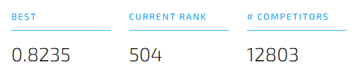

## Pump it up

Using data from Taarifa and the Tanzanian Ministry of Water, we must predict which pumps are functional, need some repairs, and which don't work at all.
A smart understanding of which waterpoints will fail can improve maintenance operations and ensure that clean, potable water is available to communities across Tanzania.

This repo contains my EDA, data cleaning, feature selection and modelling work for this DrivenData competition where I currently hold a top 4% score (0.8235). You can also find some additional experiments I performed for a set of Medium articles I wrote on this competition.

## Competition files
- [EDA](https://github.com/BrendaLoznik/waterpumps/blob/main/1.%20EDA.ipynb): Explore your data using data quality reports and visualization
- [Data cleaning & Feature selection] (https://github.com/BrendaLoznik/waterpumps/blob/main/2.%20Data%20cleaning%20%26%20Feature%20engineering.ipynb): Which features did I include in my model?
- [Modelling](https://github.com/BrendaLoznik/waterpumps/blob/main/3.%20Modelling.ipynb): from baseline models to ensembles

## Medium experiments
- [Missing data](https://github.com/BrendaLoznik/waterpumps/blob/main/2B.%20Dealing%20with%20missing%20data.ipynb): How whould you impute your missing data?
- [Feature selection] (https://github.com/BrendaLoznik/waterpumps/blob/main/2C.%20Feature%20selection%20experiments.ipynb): Dealing with multicollinearity
- [Modelling experiments] (https://github.com/BrendaLoznik/waterpumps/blob/main/3B.%20Modelling%20experiments.ipynb): Stacking specialized models

